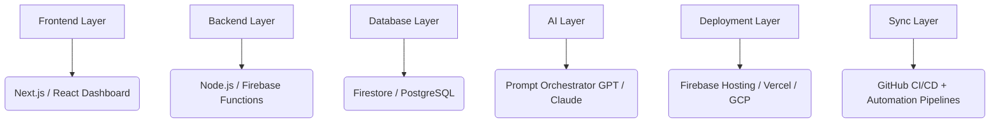

# Super AI Toolbox (NisarStudio) 🚀

Super AI Toolbox (NisarStudio) is a next-generation full-stack AI website builder and software engagement platform designed for developers, creators, and digital entrepreneurs who want to move from idea → product at maximum speed. It acts as an all-in-one AI development ecosystem where users can generate, customize, deploy, and manage AI-powered applications.

## Badges 🏅

[](https://opensource.org/licenses/MIT)
[](https://github.com/rananisarsb51214-web/Super-ai-toolbox-nisaraistudio)

---

## 📝 Table of Contents

- [About The Project](#about-the-project-heart)
- [Features](#features-star)
- [Tech Stack](#tech-stack-wrench)
- [System Architecture](#system-architecture-building-construction)
- [Key Modules](#key-modules-package)
- [Use Cases](#use-cases-rocket)
- [Design Principles](#design-principles-shield)
- [Roadmap](#roadmap-chart-with-upwards-trend)
- [Contributing](#contributing-handshake)
- [License](#license-page-facing-up)
- [NisarStudio](#nisarstudio-brain)
- [Important Links](#important-links-link)
- [Footer](#footer-man-technologist)

---

## About The Project :heart:

Super AI Toolbox (NisarStudio) is an AI-powered full-stack website builder and software engagement engine that transforms ideas into production-ready applications with minimal friction. It is a modular, AI-driven development system designed for rapid SaaS creation, landing pages, dashboards, and scalable backend systems.

It's not just a builder — it is a **full-stack AI development ecosystem** that automates:

- :gear: Application generation (frontend + backend + database)
- :computer: Website and SaaS scaffolding
- :bar_chart: Engagement and analytics systems
- :rocket: Deployment pipelines and cloud integration
- :control_knobs: Developer workflow orchestration

Built for speed, scalability, and production readiness.

---

## Features :star:

### 🧩 Full-Stack Application Generator
- Auto-generates complete apps (UI + API + DB schema).
- Supports modern stacks: Node.js, Firebase, Next.js.
- Built-in authentication, routing, and dashboard scaffolding.

### 🌐 Website & SaaS Builder
- Instant landing pages and marketing sites.
- Portfolio, business, and SaaS UI generation.
- SEO-optimized structure by default.
- Mobile-first responsive design.

### 📊 Engagement & Analytics Engine
- Built-in user tracking system.
- Lead capture forms and funnels.
- Event-based analytics pipeline.
- Notification and engagement workflows.

### ⚙️ Developer Control Layer
- GitHub sync (import/export full projects).
- Editable generated codebase.
- Modular architecture for scaling.
- Environment-aware configuration system.

### 🤖 AI Automation Core
- Multi-model AI orchestration (GPT / Claude compatible).
- Smart database schema generation.
- UI/UX layout inference from prompts.
- Automated API route generation.

---

## Tech Stack :wrench:

- **Frontend:** Next.js / React
- **Backend:** Node.js / Firebase Functions
- **Database:** Firestore / PostgreSQL (optional)
- **AI Layer:** GPT / Claude APIs
- **DevOps:** GitHub Actions / CI/CD Pipelines
- **Hosting:** Vercel / Firebase / GCP

---

## System Architecture :building_construction:



```mermaid
%% Custom styles for better readability
.componentGraphStyle {
    stroke-dasharray: 5 5;
    fill: none;
}
```

---

## Key Modules :package:

- `ai-builder-core`: Application generation engine
- `ui-generator`: Frontend UI builder
- `api-scaffolder`: Backend API generator
- `engagement-engine`: Analytics & funnel system
- `deployment-manager`: Cloud deployment automation
- `github-sync`: Repo synchronization layer

---

## Use Cases :rocket:

- SaaS MVP generation in minutes
- AI-powered startup prototyping
- Client project delivery automation
- Portfolio and agency website creation
- Internal business tool generation
- Rapid backend + API scaffolding

---

## Design Principles :shield:

- Production-first architecture
- Modular and extensible system design
- Zero manual boilerplate dependency
- Cloud-native scalability
- AI-driven automation at every layer

---

## Roadmap :chart_with_upwards_trend:

- [ ] AI Prompt-to-App generator (MVP)
- [ ] Visual workflow builder
- [ ] Multi-project workspace system
- [ ] Plugin marketplace
- [ ] Real-time collaboration mode
- [ ] Enterprise scaling layer

---

## Installation :hammer_and_wrench:

As the project is primarily a conceptual framework and a builder at this stage, there are no direct installation steps for running the entire toolbox locally without further development or setup of its components.

However, if you were to build an application using the principles of Super AI Toolbox, you would typically set up the following:

1.  **Prerequisites:**
    *   Node.js (v18+ recommended)
    *   npm or yarn
    *   Firebase CLI (if using Firebase)
    *   An OpenAI API key (or compatible provider)

2.  **Project Setup (Conceptual):
    *   Clone the repository (if applicable for specific modules).
    *   Install dependencies: `npm install` or `yarn install`.
    *   Configure environment variables (e.g., API keys for AI services, database credentials).

*Note: Specific installation instructions would depend on the module or component you intend to use or develop.* 

---

## Usage :bulb:

The Super AI Toolbox is designed to streamline the development process from idea to deployment. Here’s how you can conceptualize using it:

1.  **Define Your Idea:** Clearly outline the application you want to build (e.g., a SaaS product, a landing page, an internal tool).

2.  **Generate Core Structure:** Use the AI Automation Core to generate the initial application scaffold. This might involve providing prompts describing:
    *   The desired UI elements.
    *   The core functionalities and user flows.
    *   The data models required.
    
    *Example Prompt (Conceptual):* 
    `"Generate a full-stack web application for a task management system. Include user authentication, a dashboard with a list of tasks, a form to add new tasks, and the ability to mark tasks as complete. Use Next.js for the frontend and Firebase Firestore for the database."`

3.  **Customize and Refine:** The generated codebase is editable. Use the Developer Control Layer to:
    *   Modify the UI components in React/Next.js.
    *   Adjust the API routes and business logic in Node.js/Firebase Functions.
    *   Refine the database schema.

4.  **Integrate Engagement Features:** Utilize the Engagement & Analytics Engine to add:
    *   User tracking and event logging.
    *   Lead capture forms.
    *   Notification systems.

5.  **Deploy:** Leverage the Deployment Layer to deploy your application to cloud platforms like Vercel, Firebase Hosting, or GCP.

6.  **Sync and Iterate:** Use the GitHub sync feature to manage your codebase, track changes, and integrate with CI/CD pipelines for continuous development.

---

## How to Use :computer:

This project acts as a blueprint and a set of automated tools for building AI-powered applications rapidly. To use it effectively:

1.  **Understand the Core Loop:** The primary interaction is defining an idea via prompts and letting the AI generate the foundational code. This is followed by customization and deployment.

2.  **Leverage AI Prompts:** Experiment with different prompts to generate diverse application types. The quality of the output is highly dependent on the clarity and detail of your prompts.

3.  **Integrate AI Services:** Ensure you have necessary API keys for AI models (like GPT or Claude) configured in your environment for the AI Automation Core to function.

4.  **Explore Modules:** Dive into the specific modules (`ai-builder-core`, `ui-generator`, etc.) if you need to understand or extend their functionality.

5.  **Deployment Workflow:** Familiarize yourself with the target deployment platforms (Vercel, Firebase, GCP) as the toolbox aims to automate deployment to these.

---

## Project Structure :file_folder:

While a deep dive into the exact file structure requires analyzing the source code of each module, the conceptual structure includes:

- **`apps/`**: Potentially contains different application templates or examples.
- **`packages/`** or **`modules/`**: Contains the core components of the toolbox:
    - `ai-builder-core/`: The main AI generation engine.
    - `ui-generator/`: Frontend UI generation logic.
    - `api-scaffolder/`: Backend API scaffolding.
    - `engagement-engine/`: Analytics and user engagement modules.
    - `deployment-manager/`: Scripts and configurations for deployment.
    - `github-sync/`: Logic for GitHub integration.
- **`config/`**: Configuration files for build tools, AI services, etc.
- **`docs/`**: Documentation for the toolbox itself.
- **`README.md`**: This file.
- **`LICENSE`**: The project's license file.

---

## API Reference :scroll:

This project is an AI-powered application builder, not a direct API service. However, the generated applications will likely expose APIs based on your prompts and the `api-scaffolder` module. 

To integrate with AI services, the toolbox utilizes APIs from providers like:

- **OpenAI API:** For models like GPT-3.5/GPT-4.
- **Anthropic API:** For Claude models.

Specific API endpoints and usage within the generated applications would be determined during the generation and customization phase.

---

## Contributing :handshake:

Pull requests and contributions are welcome! If you have suggestions for how this project can be improved, please open an issue or a pull request.

1.  Fork the Project
2.  Create your Feature Branch (`git checkout -b feature/AmazingFeature`)
3.  Commit your Changes (`git commit -m 'Add some AmazingFeature'`)
4.  Push to the Branch (`git push origin feature/AmazingFeature`)
1.  Open a Pull Request

For major changes, please open an issue first to discuss what you would like to change. Please ensure to update tests or add new ones as appropriate.

---

## License :page_facing_up:

Distributed under the MIT License. See `LICENSE` for more information.

---

## NisarStudio :brain:

Built with a focus on automation, intelligence, and scalable digital systems.

> Code once. Generate forever.

---

## Important Links :link:

- **Repository:** [https://github.com/rananisarsb51214-web/Super-ai-toolbox-nisaraistudio](https://github.com/rananisarsb51214-web/Super-ai-toolbox-nisaraistudio)
- **Author Profile:** [rananisarsb51214-web](https://github.com/rananisarsb51214-web)

---

## Footer :man_technologist:

© 2023 [NisarStudio](https://github.com/rananisarsb51214-web/Super-ai-toolbox-nisaraistudio). All rights reserved.

Made with :heart: by [@rananisarsb51214-web](https://github.com/rananisarsb51214-web).

[](https://github.com/rananisarsb51214-web/Super-ai-toolbox-nisaraistudio/fork)
[](https://github.com/rananisarsb51214-web/Super-ai-toolbox-nisaraistudio/stargazers)
[](https://github.com/rananisarsb51214-web/Super-ai-toolbox-nisaraistudio/issues)


---
**<p align="center">Generated by [ReadmeCodeGen](https://www.readmecodegen.com/)</p>**